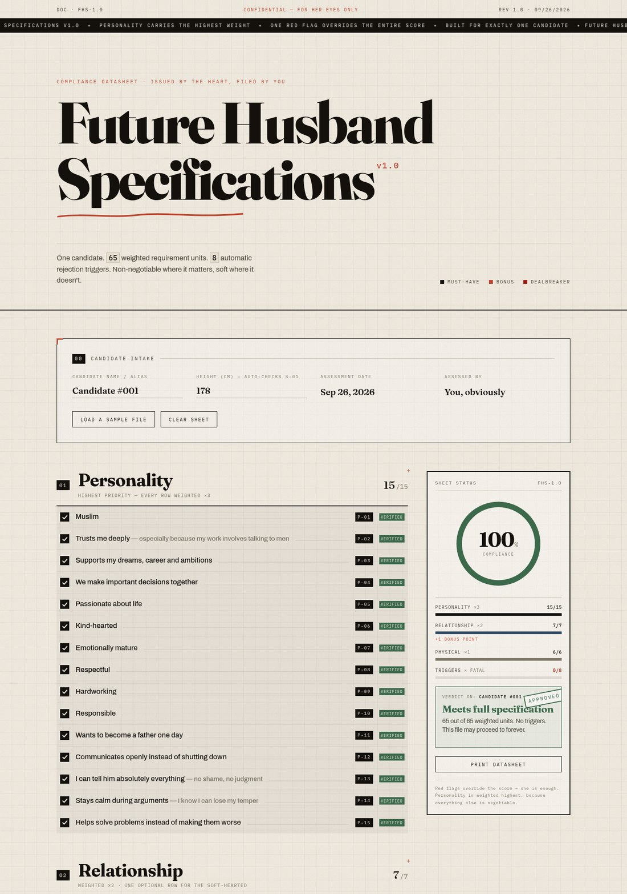

# 💍 Future Husband Specifications — v1.0

> **A compliance datasheet for one prospective life partner.**
> 65 weighted requirement units · 8 automatic rejection triggers · live compliance gauge · zero dependencies.



---

## ✦ What it is

An interactive checklist built as an **engineering datasheet** — graph paper, editorial serif headlines, mono spec codes (`P-01`, `X-05`), hairline rules and a rubber-stamped verdict.

Tick what the candidate meets, and the right-hand rail scores compliance in real time. Tick **one** red flag and the score stops mattering: the sheet stamps **REJECTED**, the gauge goes red, and processing terminates.

No frameworks, no build step, no backend. Three files: `index.html`, `styles.css`, `script.js`.

---

## ✦ How scoring works

Each section carries a weight, reflecting what actually matters:

| # | Section | Rows | Weight | Max points |
|---|---------------------|------|:------:|:----------:|
| 01 | Personality | 15 | ×3 | 45 |
| 02 | Relationship | 7 (+1 bonus) | ×2 | 14 |
| 03 | Physical | 6 | ×1 | 6 |
| | **Total required** | **28** | | **65** |

```
compliance % = (checked weighted points ÷ 65) × 100
```

- **Bonus row** (`R-08` — the forehead-kiss clause) is optional: ticking it never raises or lowers the score, it just earns a `+1 BONUS POINT` tag. Soft-hearted, but fair.
- **`S-01` (taller than 165 cm) is measured, not opinioned.** Enter a height in the intake and the row evaluates itself: `178 cm → clears the bar by 13 cm`.
- **Red flags override the score.** One tick anywhere in section 04 forces an automatic rejection, regardless of percentage.

### Verdict ladder

| State | Condition | Stamp |
|-----------------|--------------------------|---------------|
| Automatic rejection | any flag ticked | `REJECTED` 🔴 |
| Meets full specification | 92–100%, no flags | `APPROVED` 🟢 |
| Strong prospect | 75–91% | — |
| Provisional file | 50–74% | — |
| Under specification | below 50% | — |
| Awaiting data | nothing ticked yet | — |

---

## ✦ Features

- **Live compliance gauge** — animated arc + count-up percentage
- **Weighted scoring engine** with per-section tallies and progress bars
- **Red-flag override** with a slamming `REJECTED` stamp and screen shake
- **Height auto-check** for the "taller than me" requirement
- **Sticky status rail** — score, section bars and verdict always in view
- **Print stylesheet** — hit *Print datasheet* for a clean paper copy
- **Saves automatically** to `localStorage`, so a half-finished assessment survives a refresh
- **Animations** — SVG tick draw-in, staggered scroll reveals, marquee ticker, underline stroke-draw, sparkle burst on a perfect score
- **Responsive** — desktop rail collapses into a floating score pill on mobile
- **Accessible** — real checkboxes (keyboard + screen-reader friendly), `aria-live` verdict, focus rings, `<noscript>` fallback
- **No dependencies** except Google Fonts

---

## ✦ Tech stack

| | |
|---|---|
| Markup / style / logic | HTML5 · CSS3 · vanilla ES6 |
| Fonts | [Fraunces](https://fonts.google.com/specimen/Fraunces), [Archivo](https://fonts.google.com/specimen/Archivo), [IBM Plex Mono](https://fonts.google.com/specimen/IBM+Plex+Mono) |
| Dependencies | none |
| Build step | none |

All asset paths are **relative**, so the site works from any subpath — exactly what GitHub Pages needs.

---

## ✦ Run locally

```bash
git clone https://github.com/romy-dev-hub/future-husband-spec.git
cd future-husband-spec
python3 -m http.server 8000
# → http://localhost:8000
```

Or simply open `index.html` in a browser — it works straight from the filesystem too.

---

## ✦ Deploy to GitHub Pages

**1. Push the code**

```bash
git init
git add .
git commit -m "Future Husband Specifications v1.0"
git branch -M main
git remote add origin https://github.com/romy-dev-hub/future-husband-spec.git
git push -u origin main
```

**2. Enable Pages**

On GitHub: **Settings → Pages → Build and deployment**

- *Source:* **Deploy from a branch**
- *Branch:* **main** / **/ (root)**
- Click **Save**

**3. Wait ~30 seconds**, then open:

```
https://romy-dev-hub.github.io/future-husband-spec/
```

> **Tip:** drop your files in a `/docs` folder on the branch instead of the root if you want to keep the repository tidy — then select `main /docs` in the Pages settings.

---

## ✦ Customise it

| Want to… | Edit |
|---|---|
| Add / remove / reword requirements | rows in `index.html` — copy a `<li class="row">` block and give it the next spec code |
| Change section weights or totals | `WEIGHT`, `DENOM` and `MAX` at the top of `script.js` |
| Change verdict wording / score thresholds | `STATES` table and the `if/else` ladder in `script.js` |
| Change her height (the `S-01` bar) | `BARE` in `script.js` |
| Change the palette | `:root` variables at the top of `styles.css` |

**Hidden preview flags** (handy for screenshots):

- `index.html?flat=1` — reveal every animation immediately
- `index.html?demo` — auto-fills a sample candidate at 100%

---

## ✦ Project structure

```
future-husband-spec/
├── index.html          # the sheet — 28 requirement rows + 8 red flags
├── styles.css          # datasheet theme, animations, print styles
├── script.js           # scoring engine, verdicts, persistence
├── assets/
│   └── preview.jpg     # README preview
└── README.md
```

---

*Prepared with love · Rev 1.0 · All requirements subject to the heart's veto.* ✦
